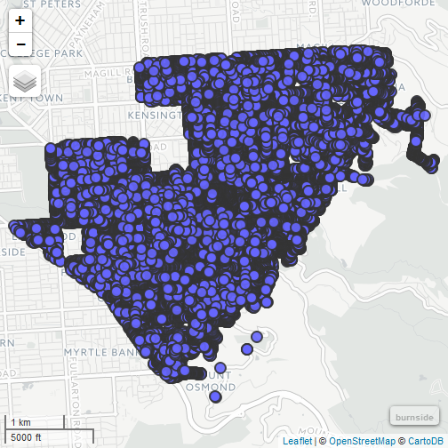
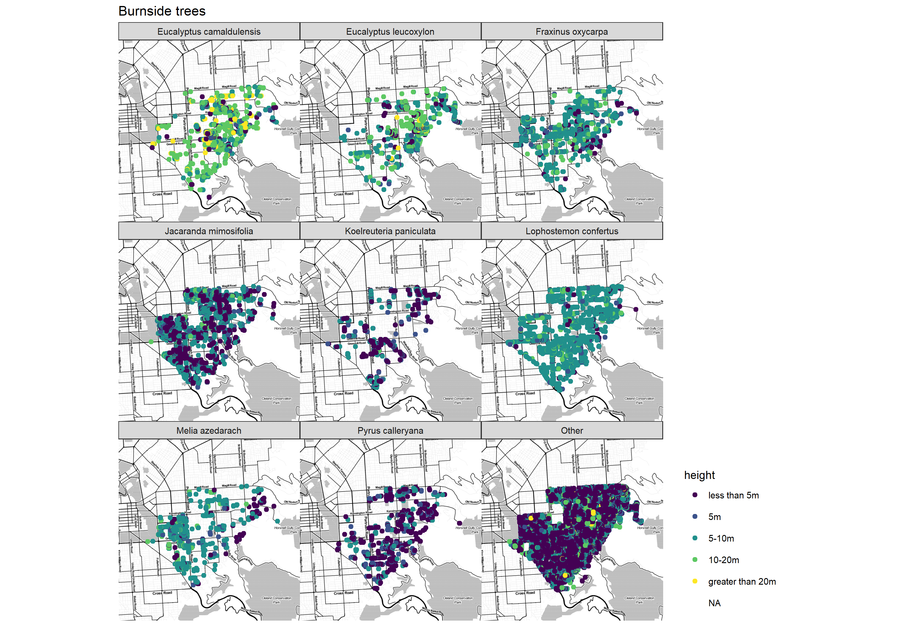
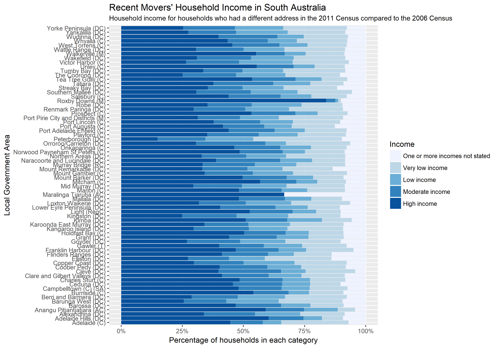

# datagovau

R package for accessing data.gov.au.

## Intro

There are many high quality data sets that are freely available for Australia. Unfortunately they can be difficult to obtain and analyse.  Here we provide tools to programmatically import and explore Australian data sets.  Data can be obtained from the official Australian government portal, which catalogues over 40,000 data sets
    (<https://data.gov.au>).  
    
data.gov.au does not itself host the data but contains links to the datasets on agencies' own sites.  The data is in a wide range of formats.  Currently the `datagovau` package can only successfully import the following data types:

- tabular data in CSV or Excel format (either as a single table or a zipped up collection of them)
- shapefiles

This project 

- started as part of the `ozdata` package from the [2017 BURGr R UnConference](https://github.com/AU-BURGr/UnConf2017)
- focused on just data.gov.au and getting CRAN-ready at the [2017 rOpenSci OzUnconf](http://ozunconf17.ropensci.org/)

## Installation


```R
devtools::install_github("ropenscilabs/datagovau/pkg")
```

## Basic usage


```r
library(dplyr)
library(datagovau)

# download details of datasets with 'water' in their name:
res <- search_data("name:water", limit = 20)

# download the datasets in the second pacakge listed their:
water_data <- res %>% filter(can_use == "yes") %>% slice(2) %>% get_data
```

```
## https://datagovau.s3.amazonaws.com/bioregionalassessments/NIC/MBC/DATA/RiskAndUncertainty/FiguresMBC_drawdown_time_series_figure/352a2f65-ddbf-4251-a401-c7070d2c9208.zip
```

```
## Working with .zip file...
```

```
## Found 4 zipped up csv or Excel files and imported them.
```

```r
# look at the first rectangle of data (at time of writing there were four such rectangles)
head(water_data[[1]])
```

```
##        Date Baseline   CRDP
## 1 1/06/1996   0.0042 0.0042
## 2 1/06/1997   0.0172 0.0172
## 3 1/06/1998   0.0401 0.0401
## 4 1/06/1999   0.0710 0.0710
## 5 1/06/2000   0.1086 0.1086
## 6 1/06/2001   0.1512 0.1512
```

## Trees!

data.gov.au lists a range of datasets with "trees" in their name.  These seem to nearly all be pinpointed locations of trees in particular areas.

### Combination with mapview

When `get_data` imports a shapefile, the resulting object is an object of class SpatialPointsDataFrame (from the `sp` package).  The `mapview` package provides nice interactive leaflet graphics (in the output below, only a screenshot provided):


```r
library(mapview)

trees_md <- search_data("name:trees", limit = 1000)
dim(trees_md) # 87 datasets about trees
```

```
## [1] 87 27
```

```r
# choose one of the datasets that happens to be a shapefile:
burnside <- trees_md %>% 
  filter(name == 'Burnside Trees - Shapefile') %>% 
  get_data()
```

```
## https://data.sa.gov.au/data/dataset/b7e1c8f6-169c-41bd-b5d7-140395a41c38/resource/89d9c056-ceda-4f7f-8d59-dce091e25705/download/burnsidetreeswgs84.zip
```

```
## Working with .zip file...
```

```
## Found a shapefile and importing it.
```

```
## OGR data source with driver: ESRI Shapefile 
## Source: "C:/Users/Peter/AppData/Local/Temp/Rtmp86QoWp/Burnside_Trees_WGS84.shp", layer: "Burnside_Trees_WGS84"
## with 36034 features
## It has 5 fields
```

```r
# draw a map:                             
mapView(burnside)@map
```



### Combination with ggmap

Of course, data that comes in a tabular form (eg CSV) can be analysed with any of the tools aimed at handling tabular data, such as ggplot2 and its friends:


```r
library(ggmap)
library(viridis)
library(scales)

#---------------------facet plot of burnside trees by species---------------
# download data
burnside2 <- trees_md %>%
  filter(name == "Burnside Trees - CSV") %>%
  get_data()

# get the background map
m <- get_map(location = c(mean(burnside2$X), mean(burnside2$Y)), 
             source = "stamen",
             maptype = "toner",
             zoom = 13)

# tidy up our data:
heights <- c("less than 5m", "5m", "5-10m", "10-20m", "greater than 20m")
d <- burnside2 %>%
  mutate(type = fct_lump(BotanicalN, 8),
         height = factor(TreeHeight, levels = heights)) 

# draw map
ggmap(m) +
  geom_point(data = d, aes(x = X, y = Y, colour = height)) +
  facet_wrap(~type) +
  scale_colour_viridis(discrete = TRUE) +
  ggtitle("Burnside trees") +
  coord_map() +
  theme_map() +
  theme(legend.position = "right")
```



## Income

Over 200 datasets are listed with "Income" in their name


```r
income_md <- search_data("name:income", limit = 1000)

# 269 datasets about income
dim(income_md)
```

```
## [1] 269  26
```

```r
movers <- income_md %>%
  filter(name == "Recent Movers Household Income") %>%
  get_data()

movers %>%
  mutate(Income = factor(Income, levels = c(
    "One or more incomes not stated",
    "Very low income", "Low income", "Moderate income", "High income"))) %>%
  rename(LGA = `LGA Name`) %>%
  filter(LGA != "South Australia") %>%
  ggplot(aes(weight = Households, fill = Income, x = LGA)) +
  geom_bar(position = "fill") +
  scale_fill_brewer() +
  coord_flip() +
  scale_y_continuous("Percentage of households in each category", label = percent) +
  labs(x = "Local Government Area") +
  ggtitle("Recent Movers' Household Income in South Australia",
          "Household income for households who had a different address in the 2011 Census compared to the 2006 Census")
```



